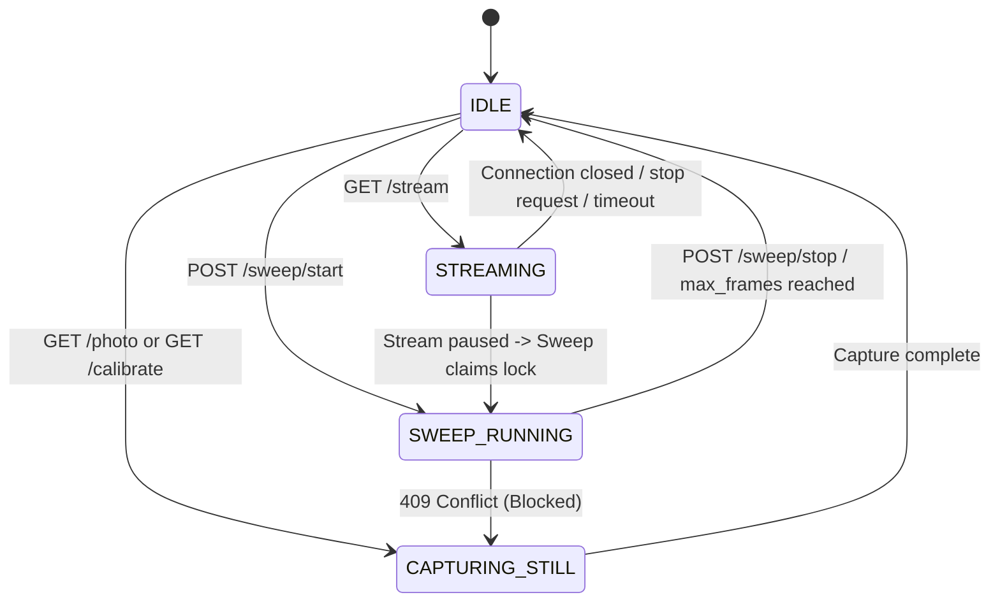

# System Architecture & Flow Index (Sweep-Based Reconstruction)

This document provides a highly detailed, comprehensive, machine-indexable description of the TermoCam Sweep-Based Reconstruction system architecture. It outlines the distributed topology, Client-Server edge partitioning, concurrency state machines, pipeline processing stages, and execution paths.

---

## Table of Contents
1. [Architectural Principles & Division of Labor](#1-architectural-principles--division-of-labor)
2. [Distributed Network Topology & Map](#2-distributed-network-topology--map)
3. [Raspberry Pi Concurrency State Machine](#3-raspberry-pi-concurrency-state-machine)
4. [File System Blueprint](#4-file-system-blueprint)
5. [End-to-End Processing Pipeline Sequence](#5-end-to-end-processing-pipeline-sequence)
6. [Stitching Hierarchy & Custom Matching Pipeline](#6-stitching-hierarchy--custom-matching-pipeline)
7. [Rectification & Normalization Pipeline](#7-rectification--normalization-pipeline)
8. [OCR Contract & PDF Generation](#8-ocr-contract--pdf-generation)
9. [Resource & Thermal Protection Constraints](#9-resource--thermal-protection-constraints)
10. [Extension Guide for Future Machine Learning Models](#10-extension-guide-for-future-machine-learning-models)
11. [Troubleshooting State Mapping](#11-troubleshooting-state-mapping)

---

## 1. Architectural Principles & Division of Labor

The TermoCam system is architected as a distributed edge-computing framework. The Raspberry Pi Zero 2W is extremely resource-constrained, possessing only 512 MB LPDDR2 RAM and a quad-core 1 GHz ARM Cortex-A53 processor. Heavy computer vision operations, keypoint extraction, homography warping, PDF compilation, and deep-learning-based OCR cannot run locally on the edge device without causing memory exhaustion, high latency, or severe thermal throttling.

### 1.1 The Edge Capture Device (Raspberry Pi Client)
The Raspberry Pi acts strictly as an **Edge Capture Appliance**. Its design constraints are:
*   **Low Memory Footprint:** No heavy libraries (like PyTorch, TensorFlow, or high-dimensional OpenCV packages) are loaded on the client.
*   **Minimal Processing:** Computes only lightweight mathematical operations—specifically, Laplacian variance for blur detection and absolute mean difference on downsampled (320x180) images for duplicate rejection.
*   **Sequential Capture:** Locks exposure, focus, and white balance to capture a stream of geometrically consistent frames during a manual sweep.
*   **Archive and Stream:** Saves qualifying frames locally, compiles a manifest of the capture session, and uploads a compressed ZIP payload to the processing server.

### 1.2 The Reconstruction Engine (Mac / Cloud Server)
The server acts as the **Heavy Compute Engine**. Its design characteristics are:
*   **Batch Processing:** Ingests the ZIP payload, extracts contents, validates integrity, and performs high-dimensional geometry alignments.
*   **Stitching:** Attempts multiple stitching algorithms (SCANS, PANORAMA, and custom ORB/SIFT homography loops) to reconstruct a unified document.
*   **Rectification:** Detects page boundaries, deskews, crops black margins, and projects the content onto a standard A4 canvas ratio.
*   **OCR:** Runs OCR engines (prefers PaddleOCR, falls back to Tesseract) and matches structured text boxes.
*   **Artifact Generation:** Compiles the rectified document to PDF and saves a complete run audit report.

---

## 2. Distributed Network Topology & Map

The physical devices operate on a shared local network or communicate across cloud endpoints:

```
+------------------------------------+
|       Raspberry Pi Zero 2W         |
|         (Edge Capture)             |
|       IP: 192.168.1.153:5000       |
+-----------------+------------------+
                  |
                  |  HTTP POST /process-sweep (ZIP multipart upload)
                  v
+-----------------+------------------+
|           Mac / Cloud              |
|      (Reconstruction Server)       |
|       IP: 192.168.1.151:8000       |
+-----------------+------------------+
                  |
                  |  HTTP POST /render (ai_results_payload.json)
                  v
+-----------------+------------------+
|         Main Raspberry Pi          |
|          (UI Engine OS)            |
|       IP: 192.168.1.151:8766       |
+------------------------------------+
```

---

## 3. Raspberry Pi Concurrency State Machine

Because the camera sensor `/dev/video0` is a shared physical resource, concurrent requests (such as a user opening the stream alignment view while a sweep is capturing) must be handled without driver crash or lock conflicts. A central lock enforces the following state transitions:



### 3.1 State Table & Transition Actions

| Current State | Requested State | Transition Action | Resulting State | HTTP Response Code |
| :--- | :--- | :--- | :--- | :--- |
| **IDLE** | **STREAMING** | Start stream generator thread, acquire camera resource | **STREAMING** | 200 OK |
| **IDLE** | **SWEEP_RUNNING** | Run autofocus once, lock exposure/focus/AWB, start loop thread | **SWEEP_RUNNING** | 200 OK |
| **IDLE** | **CAPTURING_STILL** | Trigger PDAF, capture high-res frame, release camera | **IDLE** | 200 OK |
| **STREAMING** | **SWEEP_RUNNING** | Set `stop_stream_requested` flag, wait for stream thread to release device, transition to SWEEP_RUNNING | **SWEEP_RUNNING** | 200 OK |
| **STREAMING** | **CAPTURING_STILL**| Set `stop_stream_requested` flag, wait for stream thread release, capture single still, restart stream | **STREAMING** | 200 OK |
| **SWEEP_RUNNING** | **STREAMING** | Blocked. Sweep has camera resource locked | **SWEEP_RUNNING** | 409 Conflict |
| **SWEEP_RUNNING** | **CAPTURING_STILL**| Blocked. Sweep has camera resource locked | **SWEEP_RUNNING** | 409 Conflict |
| **ANY** | **ERROR** | Exception caught, release all locks, record message | **ERROR** | 500 Internal Error |

---

## 4. File System Blueprint

All files and session folders are organized structurally to separate edge capture code, configuration scripts, processing modules, and API results.

### 4.1 Raspberry Pi Directory
*   `pi/requirements-pi.txt` — Base requirements for Flask, opencv-headless, and network utilities.
*   `pi/config.example.yaml` — Default properties for sweep capture parameters and limits.
*   `pi/live_camera_server.py` — Rest API flask app containing the locking mechanisms and state mappings.
*   `pi/templates/camera_control.html` — Dynamic web panel for preview and sweep execution.
*   `pi/capture/`
    *   `camera_backend.py` — Core Picamera2 wrapper with fallback.
    *   `frame_quality.py` — Quality metric functions (Laplacian, Tenengrad, Diff).
    *   `sweep_session.py` — Session capture scheduler and loop controller.
    *   `uploader.py` — Compiles files into a ZIP archive and performs POST uploads.
*   `pi/data/`
    *   `autofocus_photo.jpg` — Unwarped high-resolution capture image.
    *   `documento_a4_corregido.jpg` — Processed output from still capture.
    *   `sessions/` — Directory containing historical session folders.
        *   `<session_id>/`
            *   `manifest.json` — Capture session audit database.
            *   `frames/` — Directory containing accepted frame JPEGs.
            *   `rejected/` — Directory containing blur and duplicate JPEGs.

### 4.2 Reconstruction Server Directory
*   `server/requirements-server.txt` — FastAPI, Uvicorn, Pillow, PyTesseract.
*   `server/app.py` — REST endpoint routes for processing and retrieving job files.
*   `server/process_sweep.py` — Main execution pipeline managing file unzipping and staging.
*   `server/stitch.py` — OpenCV stitching pipeline.
*   `server/rectify.py` — Geometric deskew and A4 cropping.
*   `server/enhance.py` — Unsharp mask and contrast normalization functions.
*   `server/ocr.py` — Multi-engine OCR wrapper.
*   `server/debug_report.py` — Structuring tool for job reports.
*   `server/tests/` — Automated system validation tests.
*   `server/data/`
    *   `uploads/` — Staging folder for uploaded ZIP archives.
    *   `jobs/`
        *   `<job_id>/`
            *   `reconstructed.jpg` — Final high-resolution composite.
            *   `reconstructed.pdf` — PDF export.
            *   `ocr.json` — OCR transcript array.
            *   `debug_report.json` — Detailed execution and audit stats.

---

## 5. End-to-End Processing Pipeline Sequence

A full sweep execution runs through the following sequence diagram:

```
+----+                 +----+                 +----+                     +----+
|User|                 | Pi |                 |Server|                   | UI |
+-+--+                 +-+--+                 +-+--+                     +-+--+
  |                      |                      |                          |
  |  1. POST /sweep/start|                      |                          |
  +--------------------->+                      |                          |
  |                      |                      |                          |
  |                      |--2. Autofocus once   |                          |
  |                      |--3. Lock Exp/Focus   |                          |
  |                      |--4. Start Thread     |                          |
  |                      |                      |                          |
  |  5. Sweeps camera    |                      |                          |
  +--------------------->+                      |                          |
  |                      |--6. Capture frames   |                          |
  |                      |--7. Reject blur/dups |                          |
  |                      |--8. Save manifest    |                          |
  |                      |                      |                          |
  |  9. POST /sweep/stop |                      |                          |
  +--------------------->+                      |                          |
  |                      |                      |                          |
  |                      |--10. Stop thread     |                          |
  |                      |--11. Unlock camera   |                          |
  |                      |--12. ZIP session     |                          |
  |                      |--13. Upload ZIP----->+                          |
  |                      |                      |                          |
  |                      |                      |--14. Extract ZIP         |
  |                      |                      |--15. Load manifest       |
  |                      |                      |--16. Perform Stitch      |
  |                      |                      |--17. Rectify & Deskew    |
  |                      |                      |--18. Enhance Contrast    |
  |                      |                      |--19. Run OCR Engine      |
  |                      |                      |--20. Generate PDF        |
  |                      |                      |--21. Write debug report  |
  |                      |                      |                          |
  |                      |                      |--22. POST payload------->+
  |                      |                      |                          |
```

---

## 6. Stitching Hierarchy & Custom Matching Pipeline

Stitching overlapping captures is inherently difficult for a sheet of paper due to low-contrast backgrounds and uniform text blocks. The server attempts to align frames using three distinct strategies in hierarchical order:

### 6.1 Step 1: `cv2.Stitcher_SCANS`
The `cv2.Stitcher_create(cv2.Stitcher_SCANS)` configuration is optimized for flat document scans. It assumes affine transformations (translation and scale) and limits projective distortions. If the user moves the camera parallel to the paper, this method yields perfect alignment in minimal time.

### 6.2 Step 2: `cv2.Stitcher_PANORAMA`
If SCANS fails (e.g. because the user tilted the camera slightly, introducing homography distortions), the pipeline falls back to `cv2.Stitcher_create(cv2.Stitcher_PANORAMA)`. This uses a spherical projection model and estimates full 3x3 homography matrices, compensating for camera angles.

### 6.3 Step 3: Custom Feature Matching Fallback
If both built-in OpenCV stitchers fail (commonly caused by insufficient matching points in blank margins), a custom pairwise pipeline runs:
1.  **Feature Detection:** Extracts SIFT keypoints and descriptors. SIFT is scale-invariant and highly accurate for text. If SIFT is unavailable due to library configurations, ORB is utilized as a fallback.
2.  **Matching:** Runs a Brute-Force Matcher. For SIFT, $L_2$ distance is evaluated; for ORB, Hamming distance is used.
3.  **Lowe's Ratio Test:** Filters out ambiguous matches by requiring the distance ratio of the nearest neighbor to the second nearest neighbor to be $< 0.75$.
4.  **RANSAC Homography:** Computes the homography matrix $H$ using RANSAC (with a threshold of 5.0 pixels). Requires at least 8 matched coordinates.
5.  **Coordinate Mapping:** Warps the subsequent frame onto the coordinate space of the first.
6.  **Canvas Offsets:** Computes warped corner boundaries. If coordinates project into negative space, a translation matrix $T$ is applied to offset the canvas, preventing clipping.
7.  **Overlapping Blend:** Overlays the warped frame using pixel intensity checks.

---

## 7. Rectification & Normalization Pipeline

Once the stitched composite image is produced, it must be aligned to standard A4 page layout guidelines:

### 7.1 Contour-Based Quadrilateral Detection
1.  **Preprocessing:** Converts the image to grayscale, applies a $5\times5$ Gaussian filter, and performs Canny edge detection.
2.  **Contour Sorting:** Finds outer contours and sorts them in descending order of area.
3.  **Approximation:** Simplifies the contour curves using the Douglas-Peucker algorithm:
    $$\epsilon = 0.02 \times \text{arcLength}$$
4.  **Quad Filtering:** If a contour simplifies to exactly four vertices, and its bounding area covers $> 15\%$ of the overall canvas, it is recognized as the document.
5.  **Perspective Warp:** Maps the four ordered points of the document to a standard A4 template ($2480 \times 3508$ pixels) using:
    $$\text{cv2.getPerspectiveTransform}(pts\_src, pts\_dst)$$

### 7.2 Geometric Deskewing Fallback
If no quadrilateral contour is found (e.g., the stitched image contains no visible margins), the system performs text orientation alignment:
1.  **Hough Lines:** Applies Canny edge detection and performs a Hough Line Transform to detect horizontal lines of text.
2.  **Angle Calculation:** Computes the slope angle $\theta$ of each line. Filters angles to isolate horizontal-ish text paths:
    $$-45^\circ < \theta < 45^\circ$$
3.  **Median Angle Rotation:** Computes the median angle $\theta_m$ to avoid outliers and rotates the entire canvas around its center coordinates.
4.  **Content Crop:** Drops dark padding regions by finding the bounding box of non-zero pixels.
5.  **A4 Fit:** Resizes the content box to standard $2480 \times 3508$ resolution.

---

## 8. OCR Contract & PDF Generation

### 8.1 The Standard OCR JSON Schema
The `ocr.json` output must comply with the following contract, separating raw text, parsed lines, line coordinates, and data fields:

```json
{
  "text": "Full extracted text content with line breaks",
  "lines": [
    {
      "text": "Line content",
      "confidence": 0.942,
      "bbox": [[x1, y1], [x2, y2], [x3, y3], [x4, y4]]
    }
  ],
  "fields": {}
}
```

### 8.2 PDF Generation
Rather than loading large rendering engines, the system creates the PDF artifact by utilizing Pillow's direct export functionality:
1.  Opens the enhanced high-resolution BGR image.
2.  Converts the color space to RGB.
3.  Saves the image container using the `"PDF"` formatter parameter, preserving resolution and image scale without scaling artifacts.

---

## 9. Resource & Thermal Protection Constraints

Because the Raspberry Pi Zero 2W lacks cooling, running execution threads indefinitely will cause thermal damage or system lockups. The edge daemon implements these protection barriers:

*   **Thermal Monitoring:** Before starting a sweep, the server queries the SoC temperature using `vcgencmd measure_temp`. If the temp exceeds $80.0^\circ\text{C}$, the request is rejected with a 400 error.
*   **Disk Check:** Evaluates disk capacity. If free capacity is $< 50\text{MB}$, the server rejects starting a sweep to prevent database corruption.
*   **Stream Inactivity Timeout:** An alignment stream will automatically terminate and release the camera lock if no HTTP requests are received on the stream path for $300$ seconds.
*   **Frame Count Cap:** Limit the maximum capture budget per session to $120$ frames. This prevents memory leaks and ensures ZIP sizes remain manageable.

---

## 10. Extension Guide for Future Machine Learning Models

While the MVP implements lightweight, standard image processing (CLAHE, unsharp mask), a placeholder interface is created under `server/enhance.py`. Developers or LLM agents can easily integrate deep-learning-based restoration models by following these steps:

### 10.1 Steps to Integrate a Super-Resolution or Deblur Model (e.g. Restormer)
1.  **Add Dependencies:** Add required deep-learning framework lines (e.g., `torch`, `torchvision`) to `server/requirements-server.txt`.
2.  **Stage Weights:** Save the model checkpoint file under a new directory: `server/data/weights/`.
3.  **Implement Model Load:** In `server/enhance.py`, load the network architecture and weights inside a singleton class or conditional block, checking if GPUS/MPS are available.
4.  **Rewrite `enhance_for_ocr`:**
    ```python
    def enhance_for_ocr(image: np.ndarray, config: dict = None) -> np.ndarray:
        # 1. Fallback to basic operations if weights are missing
        if not weights_exist:
            return apply_lightweight_clahe(image)
        # 2. Convert BGR to RGB tensor
        # 3. Model forward pass (e.g., Deblur, Super-Resolution)
        # 4. Convert output back to numpy BGR image and return
    ```

---

## 11. Troubleshooting State Mapping

This mapping correlates physical failures to their corresponding state and API codes:

| Physical Failure | Observed Symptoms | State Machine State | API Action & Troubleshooting Route |
| :--- | :--- | :--- | :--- |
| **Camera Busy** | V4L2 resource locked, thread block | `STREAMING` or `SWEEP_RUNNING` | Return `409 Conflict`. Stop alignment stream before proceeding. |
| **No Focus lock** | Image is blurry | `ERROR` or `IDLE` | Trigger macro focus ranges or increase PDAF lock time in `CameraBackend.capture_jpeg`. |
| **Thermal Limit** | CPU throttle, FPS drop | `ERROR` | Reject starts if $> 80^\circ\text{C}$. Implement cooling or power down Pi for 5 minutes. |
| **Stitching Failure** | Stitched image is None | `failed` (Server job status) | Custom fallback returns status. Ensure user has $60\text{--}80\%$ overlap between frames. |
| **Disk Exhaustion**| Manifest cannot write | `ERROR` | Reject start if $< 50\text{MB}$. Issue a `DELETE /sweep/<session_id>` call on old sessions. |
